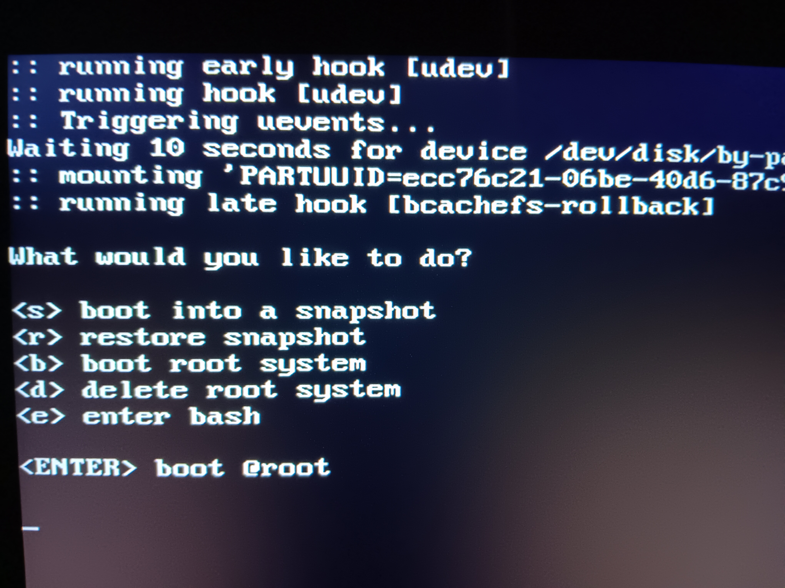

It is highly recommended that you read all of this information before proceeding!

Please note that this is experimental and only for use on non-producion machines. Do not run this program unless you have read and understand all the code within. This has only been tested on my own system, and I am not a professional coder. Chances are high that your system may become borked by running this.

I made this script because I was unable to find anything else online that allowed a person to easily do rollbacks and/or boot into snapshots on bcachefs. It would be great to get the ball rolling, even if this is not 'good quality' code to start with. My hope is that others will use/modify this program and report back with the changes so all can benefit.

Enjoy! :)

# bcachefs-rollback
This program is a mkinitcpio hook that allows booting into snapshots and rollback on bcachefs

# Installation:

I should mention that I'm not entirely sure how flexible this program is with certain subvolume, boot, and efi setups.

For reference, here is what my /etc/fstab looks like:


```
# /dev/nvme0n1p4 LABEL=ROOT-laptop
UUID=9255082a-98bf-40b3-b26b-b79a1096cc4b       /               bcachefs        rw,noatime      0 0

# /dev/nvme0n1p2 LABEL=BOOT
UUID=63600023-1a46-4983-b17f-9487092fba31       /boot           ext2            rw,noatime      0 2

# /dev/nvme0n1p1 LABEL=EFI
UUID=42C6-79ED          /efi            vfat            rw,noatime,fmask=0022,dmask=0022,codepage=437,iocharset=ascii,shortname=mixed,utf8,errors=remount-ro        0 2

#/.snapshots                /.snapshots          none            rw,noatime,rw,noshard_inode_numbers,bind  0 0

/var/log                /var/log          none            rw,noatime,rw,noshard_inode_numbers,bind  0 0

/var/tmp                /var/tmp          none            rw,noatime,rw,noshard_inode_numbers,bind  0 0
```

In order to be able to access your snapshots, you must have your snapshots directory at /.snapshots.
DO NOT mount this snapshot directory in /etc/fstab. The hooks will mount it automatically.

.

Copy the bcachefs-rollback hooks file to /usr/lib/initcpio/hooks/

Copy the bcachefs-rollback install file to /usr/lib/initcpio/install/

.

Edit /usr/lib/initcpio/hooks/bcachefs-rollback and make sure that the variable LABEL (near the top of the script) is set to your root partition label:

```
LABEL=MY-ROOT-LABEL
```

You can find your root partition label by running the command:
```
blkid
```

Edit /etc/mkinitcpio.conf to include the 'bcachefs-rollback' hook and 'bcachefs' module. Your system's hooks may look different, but just make sure that you add the 'bcachefs-rollback' hook after the 'filesystems' hook (I'm not 100% sure where this hook should go, but this seems to work for me):

```
MODULES=(bcachefs)

HOOKS=(base udev autodetect microcode modconf keyboard block filesystems bcachefs-rollback)
```

Update initramfs with:

```
mkinitcpio -P
```


# Setting it up:

First check to see if the hook is working by booting up your system. It should look close to this:



Choose the 'boot root system' menu option. This will boot you into your regular system. If all is okay, make a snapshot for your / drive (the snapshot may be r/o as shown below):

```
bcachefs subvolume snapshot -r / /.snapshots/initial
```

Then restart your computer and choose the 'restore snapshot' option from the booting menu. Type the full word 'initial' (or whatever you've named the snapshot) into the prompt. The system should then take a snapshot of /.snapshots/initial and store it in /@root, which is your new main system. The program will then automatically boot you into /@root. This step should still create a read/write snapshot of /@root even if the 'initial' snapshot was read only.

# Running the program:

From now on when the computer boots up to the bcachefs-rollback menu you may either wait 15 seconds for the menu to timeout (will boot into /@root) or just press the ENTER key to immidiately boot into /@root.

If all is okay and you'd like to get rid of the residual files on your original / drive (which can be accessed by choosing the 'boot root system' option in the boot menu), choose the 'delete root system' option. This is experimental! If everything checks out, all except /.snapshots and /@root should remain. At this point all your system files will be in /@root.

# TODO

- Find a way to easily select snapshots within the menu. ATM they must be fully typed out.

# Bugs

- The first restore (before /@root is created) will result in a small error when the system attempts to move a non-existant backup snapshot of /@root to /.snapshots [FIXED]
